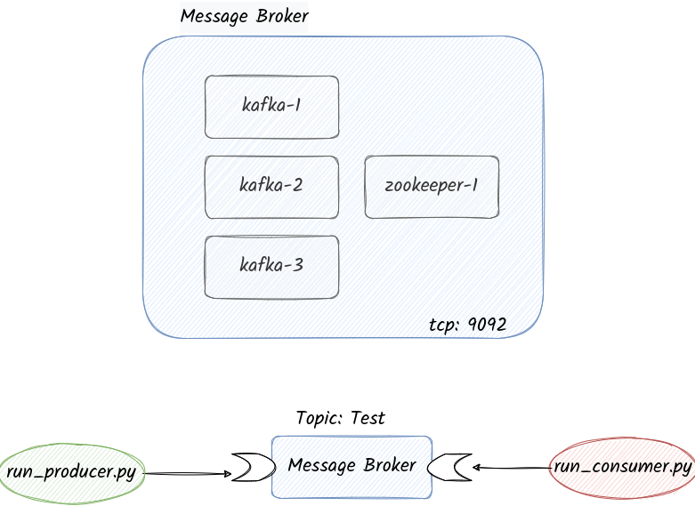

## Kafka-Python
Producer and consumer basic application


## Infrastructure
- https://github.com/joagonzalez/infrastructure/tree/master/docker/kafka

```
docker stack deploy -c docker-compose.yaml eventdriven
```



## Consumer command
```bash
/kafka/bin/kafka-console-consumer.sh \
--bootstrap-server kafka-1:9092,kafka-2:9092,kafka-3:9092 \
--topic Orders --from-beginning
```

## Producer command
```
echo "New Order: 1" | \
/kafka/bin/kafka-console-producer.sh \
--broker-list kafka-1:9092,kafka-2:9092,kafka-3:9092 \
--topic Orders > /dev/null
```

### Reference
 - https://andres-plazas.medium.com/leer-y-escribir-datos-en-kafka-usando-python-2696154c3948